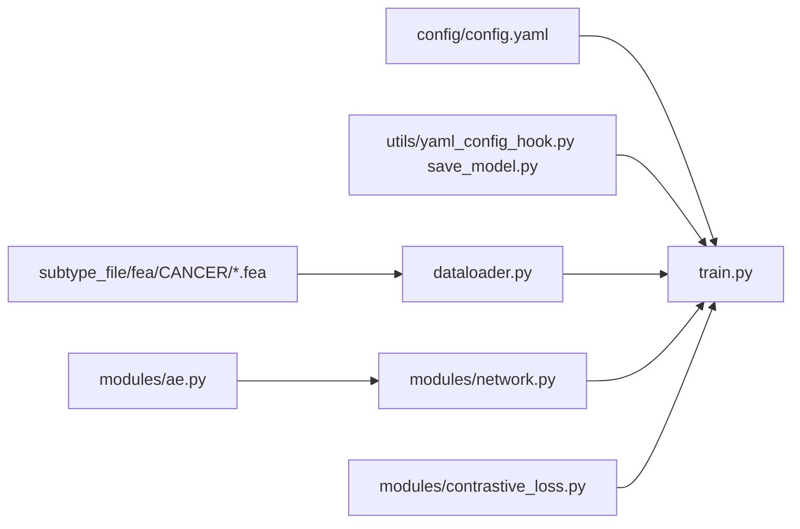

# Subtype-DCC 论文实验复现计划

## 论文与仓库对齐要点

- **数据与预处理**：论文 *Benchmark datasets* 写明九种 TCGA 癌种、四组学（CNV、mRNA、miRNA、甲基化）、特征维度合计 **9844**（3105 + 3217 + 383 + 3139），样本量与癌种列表与您需求一致；预处理遵循 **Subtype-GAN 论文 [26]**（[Bioinformatics 2021](https://doi.org/10.1093/bioinformatics/btab036)），即与 [haiyang1986/Subtype-GAN](https://github.com/haiyang1986/Subtype-GAN) 流程一致。
- **评估指标**：生存差异用 **log-rank** 得到 **−log10(P)**；临床关联对 **6 个变量**（年龄、性别、pathologic stage/T/N/M）分别检验：分类变量 **χ²**，连续年龄 **Kruskal–Wallis**，统计显著项个数——与 Rappoport & Shamir **NAR 2018 [46]** 的基准设定一致。
- **超参与结构**：默认对比学习用 **Gaussian noise** 增广；编码器 **MLP 5000→2000→1000→256**（见 `[modules/ae.py](https://github.com/zhaojingo/Subtype-DCC/blob/main/Subtype-DCC/modules/ae.py)`）；batch **64**、lr **3e-4**、实例温度 **0.5**、簇温度 **1**、训练轮数等见 `[config/config.yaml](https://github.com/zhaojingo/Subtype-DCC/blob/main/Subtype-DCC/config/config.yaml)` 与论文 *Experimental settings*；**预设簇数 M** 与 `[train.py` 中 `cancer_dict](https://github.com/zhaojingo/Subtype-DCC/blob/main/Subtype-DCC/train.py)` 一致（如 KIRC=4，LUAD=3 等）。

---

## 1）代码文件关系（Subtype-DCC 仓库）

| 组件                                                                                                                          | 职责                                                                                                                                                 |
| --------------------------------------------------------------------------------------------------------------------------- | -------------------------------------------------------------------------------------------------------------------------------------------------- |
| `[train.py](https://github.com/zhaojingo/Subtype-DCC/blob/main/Subtype-DCC/train.py)`                                       | 解析参数与 `cancer_dict` 簇数；读配置；构建 `AE` + `Network`；训练循环（双视图高斯噪声 + `DCL` + `ClusterLoss`）；保存 checkpoint；推理写出 `./results/{CANCER}.dcc`（簇标签）与 `.fea`（嵌入）。 |
| `[dataloader.py](https://github.com/zhaojingo/Subtype-DCC/blob/main/Subtype-DCC/dataloader.py)`                             | 读四个 `*.fea`，按 **行拼接后转置** 得到样本×特征矩阵；**按样本 `MinMaxScaler`**；`DataLoader`。                                                                            |
| `[modules/ae.py](https://github.com/zhaojingo/Subtype-DCC/blob/main/Subtype-DCC/modules/ae.py)`                             | PCB：四层 MLP 编码（默认 `input_dim=9844`）。                                                                                                                |
| `[modules/network.py](https://github.com/zhaojingo/Subtype-DCC/blob/main/Subtype-DCC/modules/network.py)`                   | 在编码嵌入上接 **ICH / CCH** 投影头（与对比损失配合）。                                                                                                                |
| `[modules/contrastive_loss.py](https://github.com/zhaojingo/Subtype-DCC/blob/main/Subtype-DCC/modules/contrastive_loss.py)` | Decoupled instance loss（DCL）与 cluster-level loss。                                                                                                  |
| `[config/config.yaml](https://github.com/zhaojingo/Subtype-DCC/blob/main/Subtype-DCC/config/config.yaml)`                   | seed、epochs、学习率、`feature_dim`、温度等。                                                                                                                 |

**路径约定**：`dataloader` 使用相对路径 `../subtype_file/fea/{CANCER}/`，因此在运行 `train.py` 时应在 `[Subtype-DCC/Subtype-DCC/](https://github.com/zhaojingo/Subtype-DCC/tree/main/Subtype-DCC)` 下执行，并在上一级建立 `subtype_file/fea`（通常 **符号链接或复制** 自 Subtype-GAN 的 `fea/`）。

**缺口**：官方仓库 **不包含** log-rank、临床富集、Kaplan–Meier、t-SNE 论文图、十种 baseline 的批量脚本；这些属于复现工作中需新增的 **评测与分析层**。

---

## 2）需要准备的数据集

| 来源                                                                                                  | 内容                                                                                                                                                                                                                                              | 用途                                                                          |
| --------------------------------------------------------------------------------------------------- | ----------------------------------------------------------------------------------------------------------------------------------------------------------------------------------------------------------------------------------------------- | --------------------------------------------------------------------------- |
| [Subtype-GAN 仓库 `fea/{BRCA,BLCA,...}/](https://github.com/haiyang1986/Subtype-GAN/tree/master/fea)` | 每个癌种四个文件：`CN.fea`、`meth.fea`、`miRNA.fea`、`rna.fea`（CSV，行为特征、列为样本）                                                                                                                                                                               | Subtype-DCC **唯一指定**输入；体积大，建议 **git clone**（若启用 LFS 需安装 Git LFS）。           |
| TCGA 临床与随访                                                                                          | 论文/SubtypeGAN 脚本引用 `**clinical_PANCAN_patient_with_followup.tsv`**（见 `[SubtypeGAN.py` -s 默认路径]([https://github.com/haiyang1986/Subtype-GAN/blob/master/SubtypeGAN.py)）](https://github.com/haiyang1986/Subtype-GAN/blob/master/SubtypeGAN.py)）) | 生存曲线、log-rank、临床变量表；需自行从 GDC/legacy Pan-Cancer 资源获取并与 **条形码** 与 `fea` 列名对齐。 |

无需从零下载原始 TCGA 测序文件即可复现 **Subtype-DCC 主模型**，前提是使用 Subtype-GAN 已发布的 `fea`；若要做 **从零预处理**，则需按 Subtype-GAN [26] 重做特征构建（工作量大，一般不必要）。

---

## 3）十种现有方法的实现方式（现状与建议）

论文 Table 1 中的方法 **均不在 Subtype-DCC 仓库内**。实际落地分三类：

**A. Subtype-GAN 仓库已覆盖（Python + 旧栈 TF1/Keras）**

- **Subtype-GAN**：`-m SubtypeGAN`（GAN 特征 + GMM）；**Spectral**、**K-means**：`-m spectral` / `-m kmeans`（对 **拼接后的多组学矩阵** 聚类，与论文“early integration”类 baseline 一致）。
- 仓库另有 `ae`、`vae` 等模式，**不等于**论文中的 NMF/MCCA/iCluster 等。

**B. Subtype-GAN 仓库部分辅助**

- **PINS**：`[pins_run.R](https://github.com/haiyang1986/Subtype-GAN/blob/master/pins_run.R)` — 需在 R 中安装对应包并按同样特征矩阵调用。

**C. 需单独安装与脚本化（与 NAR 2018 [46] / 各领域原始包一致）**

| 方法             | 典型实现入口                                                       |
| -------------- | ------------------------------------------------------------ |
| **SNF**        | R 包 `SNFtool`（原文 Nature Methods 2014）                        |
| **NEMO**       | R 包 `NEMO`（Bioinformatics 2019）                              |
| **NMF**        | R `NMF` 或按矩阵分解后对簇指派                                          |
| **MCCA**       | 多维典型相关：`PMA`、`CCA`、`RGCCA` 等（需固定簇数时在潜空间上 **K-means / 层次聚类**） |
| **iCluster**   | Bioconductor `iClusterPlus` / `iCluster`                     |
| **LRACluster** | 作者提供的 **LRAcluster** R/Matlab 实现或文献附带代码                      |

**与您目标的差距**：要实现论文级 **Table 1 + Figure 2**，需要统一：**同一批样本、同一固定簇数 M、每种方法多次随机种子取平均**（论文写明波动方法 **重复 5 次取均值**）。建议新建 `benchmarks/`：每种方法一个适配脚本，读入与 Subtype-DCC 相同的对齐矩阵（或各方法要求的视角列表），输出 `sample_id, cluster_id`。

---

## 4）数据集是否有统一预处理方式？

**有，且分两层：**

1. **第一层（论文所述 [26]）**：由 Subtype-GAN 管线生成 `fea`：例如对 miRNA/mRNA 做 **log2(x+1)**，再对各数据矩阵 **StandardScaler（按特征 z-score）** 等（见 `[SubtypeGAN.py` 中生成单组学 `*.fea` 片段]([https://github.com/haiyang1986/Subtype-GAN/blob/master/SubtypeGAN.py](https://github.com/haiyang1986/Subtype-GAN/blob/master/SubtypeGAN.py)) 约 452–456 行）。发布在 GitHub 上的 `fea/*.fea` **已是该步之后的结果**。
2. **第二层（Subtype-DCC 独有）**：`[dataloader.py](https://github.com/zhaojingo/Subtype-DCC/blob/main/Subtype-DCC/dataloader.py)` 将四组学 **拼接为单行本** 后，再对每个样本整段向量做 `**sklearn.preprocessing.MinMaxScaler`**（按列 min-max，此处列为样本维度需注意：实际是 **对特征列** 在 `fit_transform` 中作用于 **拼接后的特征矩阵**，与论文“输入空间统一缩放”一致）。

**Baseline 公平性**：论文要求各方法使用 **相同预处理后的数据**。实践上应对 **所有 baseline** 使用 **同一套对齐后的数值矩阵**（或与 SNF/NEMO 各自论文一致的视图输入，但样本集合一致）；避免仅 Subtype-DCC 使用 MinMax 而其他方法用原始尺度——若无法在某方法内禁用二次缩放，须在文档中说明差异。

---

## 建议复现步骤（执行顺序）

1. **环境**：按 Subtype-DCC `[README.md](https://github.com/zhaojingo/Subtype-DCC/blob/main/README.md)` + `[environment.yaml](https://github.com/zhaojingo/Subtype-DCC/blob/main/environment.yaml)` 建 Conda；GPU 推荐 CUDA 与 PyTorch 版本匹配。
2. **数据布局**：Clone Subtype-GAN；在 Subtype-DCC 子目录上级创建 `subtype_file/fea` → 指向或复制 `fea`。
3. **跑通 Subtype-DCC**：在 `Subtype-DCC/Subtype-DCC` 下对每个癌种执行 `python train.py -c {TYPE}`；检查 `results/*.dcc`、`.fea`；**固定 `config.yaml` 与 seed**，必要时 **5 次重复** 与论文一致。
4. **评测脚本（新建）**：读 `*.dcc` 与各 baseline 标签；匹配临床表；计算 **−log10(log-rank P)** 与 **6 项临床显著个数**；汇总为 Table/Figure 2 风格。
5. **生存曲线**：R `survival` + `survminer` 或 Python `lifelines`；按 Subtype-DCC 簇着色（Figure 3）。
6. **t-SNE**：对 `results/{CANCER}.fea` 用 `sklearn.manifold.TSNE`（或论文一致参数）着色为簇标签（Figure 4A 类图）。
7. **临床富集条形图**：对各方法汇总「显著临床项数量」或分项 Fisher/χ² P 值条形图（对齐 Figure 2B）。
8. **消融**：按论文 *Figure S1*，修改数据管线 **依次去掉 CNV / meth / miRNA / mRNA 一整块特征**，重新训练 Subtype-DCC，重复步骤 4 指标。

---

## 风险与校验

- `**train.py` 细节**：训练循环末尾每次 `save_model` 使用固定 `args.epochs` 命名 checkpoint，且推理前重新实例化网络—若实际保存逻辑与 epoch 不一致需核对能否正确加载。
- **依赖老旧**：Subtype-GAN 依赖 **TensorFlow 1.x**，与现代 Python 环境隔离（单独 conda env）。
- **结果数值**：Table 1 为单次论文报告；随机种子、PyTorch/CUDA 版本可能导致略有偏差；以 **流程正确 + 趋势一致** 为务实目标，严格数值复现需固定全套版本与 5 次平均。

